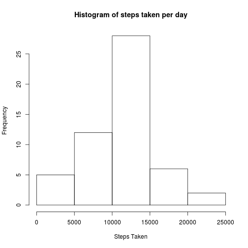
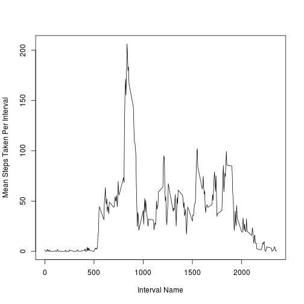
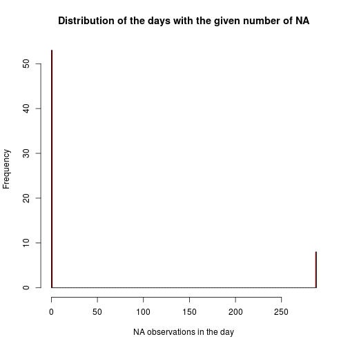
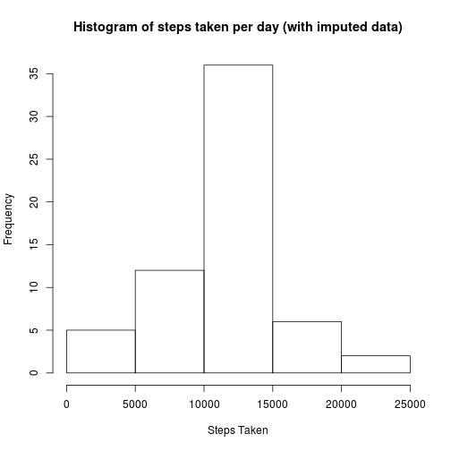
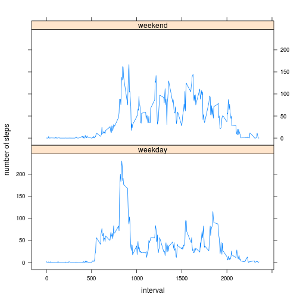

# Reproducible Research: Peer Assessment 1
## Loading and preprocessing the data
Read the data into R from the working directory:

```r
my_data <- read.csv("activity.csv")
```

Processing and transforming the data:
Add a column with the date as class "Date"

```r
my_data$as_a_date <- as.Date(my_data$date)
```
### Some initial observations of the data:

```r
number_unique_days <- length(unique(my_data$date))
```
Therefore there are 61 unique days in the dataset.

```r
number_unique_intervals <- length(unique(my_data$interval))
```
Therefore there are 288 unique intervals in the dataset.

288 intervals * 61 days = 17568, the number of rows in the dataset.

There are 288 5m intervals in a single day, therefore I assume that the label on each interval corresponds to the number of minutes that have elapsed from midnight to the start of the interval.

### Prepare a histogram for the total steps taken each day:

Group the data by Date using the dplyr package:

```r
library(dplyr)
group_by_day <- group_by(my_data, date)
total_steps_by_day <- summarize(group_by_day, sum=sum(steps))
```

Make the histogram:


```r
hist(total_steps_by_day$sum, 
     main = "Histogram of steps taken per day", 
     xlab = "Steps Taken")
```

 
  
## What is the mean total number of steps taken per day?

```r
mean_steps_per_day <- mean(total_steps_by_day$sum, na.rm=TRUE)
```
The mean number of total steps taken through the 61 days is 10766.1886792.

Prepare the median of the steps taken in a day:

```r
median_steps_per_day <- median(total_steps_by_day$sum, na.rm=TRUE)
```
The median number of total steps taken in a day is 10765.

## What is the average daily activity pattern?

```r
group_by_interval <- group_by(my_data, interval)
mean_steps_by_interval <- summarize(group_by_interval, 
                                    mean=mean(steps, na.rm=TRUE))
plot(mean_steps_by_interval$mean ~ mean_steps_by_interval$interval, 
     type="l", 
     xlab = "Interval Name", 
     ylab = "Mean Steps Taken Per Interval")
```

 

### Which 5m interval has, on average, the most amount of steps?

```r
max_steps_interval <- unlist(
      mean_steps_by_interval[which.max(mean_steps_by_interval$mean), 1])
```
The interval that has the maximum number of steps, averaged across days in the dataset, is the interval labelled 835.


## Imputing missing values
### Calculate the number of missing values (NA) in the steps column:

```r
index_to_impute <- which(is.na(my_data$steps))
number_of_NA <- length(index_to_impute)
```
The number of NAs that need to be replaced with an imputed value is 2304.

### How are these NAs distributed across the days?


```r
na_count_by_day <- summarize(group_by_day, total=sum(is.na(steps)))
hist(na_count_by_day$total, 
     breaks = 288, 
     main = "Distribution of the days with the given number of NA", 
     xlab = "NA observations in the day", 
     col = "red")
```

 

It seems that a day has either 288 NA entries, or none, with no intermediate values. Since there are 288 intervals in each day, I conclude that there is either a full dataset for a particular day, or no data at all. There are 8 days that are entirely composed of NA.  There are 2304 NA entries in the data, and 288 * 8 = 2304.

Impute by using the mean for that particular interval:


```r
# Prepare a new data frame to add imputed data to:
my_imputed_data <- my_data
# Loop through the list of rows to impute, 
# while replacing the NA with the average for that particular interval:
for (i in 1:length(index_to_impute)){ 
      # find the interval corresponding to the NA
      interval_of_interest <- my_data[index_to_impute[i], 3] 
      # Search for the interval of interest in the mean_steps_by_interval data, 
      # and insert the mean into the appropriate spot in my_imputed_data:
      my_imputed_data[index_to_impute[i],1] <- mean_steps_by_interval[grep(
              paste0("^", interval_of_interest, "$"),
              mean_steps_by_interval$interval), 2]
}
```

### Report on the imputed data:
Group the data by Date using the dplyr package:

```r
imputed_group_by_day <- group_by(my_imputed_data, date)
imputed_total_steps_by_day <- summarize(imputed_group_by_day, sum=sum(steps))
```
## Prepare a histogram for the total steps taken each day:

```r
hist(imputed_total_steps_by_day$sum, main = "Histogram of steps taken per day (with imputed data)", xlab = "Steps Taken")
```

 
  
### What is the mean total number of steps taken per day?

```r
imputed_mean_steps_per_day <- mean(imputed_total_steps_by_day$sum, 
                                   na.rm=TRUE)
```
The mean number of total steps taken through the 61 days when imputed data is used is 10766.1886792. 

Prepare the median of the steps taken in a day:

```r
imputed_median_steps_per_day <- median(imputed_total_steps_by_day$sum, 
                                       na.rm=TRUE)
```
The median number of total steps taken in a day using imputed data is 10766.1886792.

How do these values compare with those of the raw data?

```r
#calculate the change in the mean:
delta_mean <- imputed_mean_steps_per_day - mean_steps_per_day
#calculate the change in the median:
delta_median <- imputed_median_steps_per_day - median_steps_per_day
```

### The impact of imputing missing data:  

The mean total steps per day did not change: 0.  
The median total steps per day increased by 1.1886792.

It is not surprising that the mean total steps per day did not change. All we did was replace the 8 days full of NA with data representing the average day. Increasing n with data that is identical to the existing data will not affect the mean.

The median, however, did increase slightly. This may be explained by the fact that the mean is higher than the median in the raw data. Increasing n with data that is higher than the median (as the average is) would be expected to increase the median of the resulting data, in this case by a small amount.

## Are there differences in activity patterns between weekdays and weekends?

Insert a new column containing the day of the week using the weekdays() function:


```r
my_imputed_data$weekday <- as.factor(weekdays(my_imputed_data$as_a_date))
```

Insert a new column with listing weekday or weekend as a factor:


```r
my_imputed_data$day_type <- my_imputed_data$weekday == "Saturday" | my_imputed_data$weekday == "Sunday"

my_imputed_data$day_type <- as.factor(my_imputed_data$day_type)
levels(my_imputed_data$day_type) <- c("weekday", "weekend")
```

Summarize the data by interval and day type, then prepare a plot:


```r
by_interval_day_type <- group_by(my_imputed_data, interval, day_type)
to_plot <- summarize(by_interval_day_type, mean = mean(steps))

library(lattice)
xyplot(to_plot$mean ~ to_plot$interval | to_plot$day_type, type = "l", 
      layout = c(1, 2), ylab="number of steps", xlab="interval")
```

 


Some observations on daily activities:  

- There are less steps taken in the morning on the weekends.
- There are more steps taken late in the evening on the weekends.


